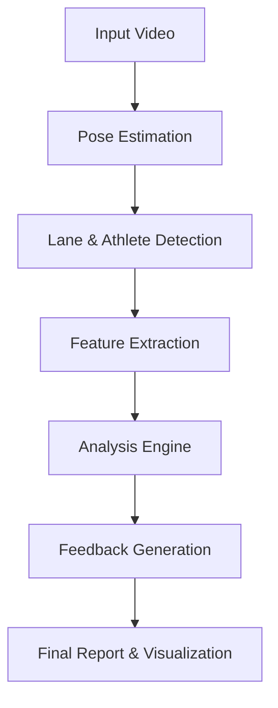

# System Architecture & Workflow
# معماری سیستم و جریان کار

This document describes the technical architecture and processing pipeline of the Speed Climbing Performance Analysis system.
این سند معماری فنی و پایپ‌لاین پردازش سیستم تحلیل عملکرد صعود سرعتی را شرح می‌دهد.

---

## 🔄 High-Level Pipeline / نمای کلی پایپ‌لاین

The system follows a linear pipeline approach to transform raw video footage into actionable coaching feedback.
سیستم از یک رویکرد پایپ‌لاین خطی برای تبدیل ویدئوی خام به بازخورد مربیگری قابل اجرا استفاده می‌کند.

---

## 1. Pose Estimation (Vision Layer)
## ۱. تخمین پوز (لایه بینایی)

**Module**: `speed_climbing.vision.pose`

The system uses **Google MediaPipe BlazePose** to extract 33 3D body landmarks from each video frame.
سیستم از **Google MediaPipe BlazePose** برای استخراج ۳۳ نقطه کلیدی سه بعدی بدن از هر فریم ویدئو استفاده می‌کند.

- **Input**: Raw video frames (30/60 FPS)
- **Process**: 
  - CNN-based body detection
  - Landmark regression (x, y, z, visibility)
- **Output**: `PoseData` object containing time-series of body coordinates.

> **Note**: We use the "Heavy" model complexity for maximum accuracy, even at the cost of processing speed.
> **نکته**: ما از مدل با پیچیدگی "Heavy" برای حداکثر دقت استفاده می‌کنیم، حتی به قیمت سرعت پردازش کمتر.

---

## 2. Lane & Athlete Detection
## ۲. تشخیص مسیر و ورزشکار

**Module**: `speed_climbing.vision.lanes` & `athlete_detector`

Since speed climbing involves two parallel lanes, the system must identify which athlete to analyze.
از آنجا که صعود سرعتی شامل دو مسیر موازی است، سیستم باید تشخیص دهد کدام ورزشکار را تحلیل کند.

- **Dual-Lane Logic**: Splits the frame vertically to separate Left vs. Right lane.
- **Athlete Presence**: Detects if one or two athletes are climbing.
- **Lane Assignment**: Automatically assigns the detected skeleton to the correct lane based on Hip X-coordinate.

---

## 3. Feature Extraction (Biomechanics)
## ۳. استخراج ویژگی (بیومکانیک)

**Module**: `speed_climbing.analysis.features`

Raw coordinates are converted into meaningful biomechanical features.
مختصات خام به ویژگی‌های بیومکانیکی معنادار تبدیل می‌شوند.

### Key Features / ویژگی‌های کلیدی:
1. **Posture (وضعیت بدن)**:
   - Knee & Elbow angles (زوایای زانو و آرنج)
   - Body lean angle (زاویه انحراف بدن)
   - Hip width ratio (نسبت عرض لگن به دیوار)

2. **Movement (حرکت)**:
   - Limb synchronization (هماهنگی اندام‌ها)
   - Movement fluidity (روانی حرکت)
   - Reach ratios (نسبت‌های کشش)

3. **Temporal (زمانی)**:
   - Start reaction time (estimated)
   - Total climb duration
   - Stop/Go phases

> **Camera Independence**: We prioritize features that are robust to camera movement (angles, relative ratios) over absolute features (speed in m/s) which require fixed cameras.
> **استقلال از دوربین**: ما ویژگی‌هایی را در اولویت قرار می‌دهیم که نسبت به حرکت دوربین مقاوم هستند (زوایا، نسبت‌های نسبی) نسبت به ویژگی‌های مطلق (سرعت بر حسب متر بر ثانیه) که نیاز به دوربین ثابت دارند.

---

## 4. Analysis Engine (Fuzzy Logic)
## ۴. موتور تحلیل (منطق فازی)

**Module**: `speed_climbing.analysis.feedback.fuzzy_engine`

Instead of hard thresholds (e.g., "Angle > 90 is bad"), we use **Fuzzy Logic** to handle the nuance of human movement.
به جای آستانه‌های سخت (مثلاً "زاویه بالای ۹۰ بد است")، ما از **منطق فازی** برای مدیریت ظرافت‌های حرکت انسان استفاده می‌کنیم.

- **Inputs**: Numerical features (e.g., Knee Angle = 85°)
- **Fuzzy Sets**: Low, Optimal, High (e.g., "Too Bent", "Good", "Too Straight")
- **Rules**: Expert-defined rules (e.g., "IF Knee IS Too Bent THEN Leg Technique IS Poor")
- **Output**: Qualitative scores (0-100) for each category.

---

## 5. Feedback Generation
## ۵. تولید بازخورد

**Module**: `speed_climbing.analysis.feedback.feedback_generator`

The system generates human-readable text based on the analysis scores.
سیستم متن قابل خواندن برای انسان را بر اساس امتیازات تحلیل تولید می‌کند.

- **Categories**:
  - Coordination (هماهنگی)
  - Leg Technique (تکنیک پا)
  - Arm Technique (تکنیک دست)
  - Body Position (وضعیت بدن)
- **Bilingual Support**: Templates for both English and Persian.
- **Comparison**: Optionally compares the athlete's metrics against a database of World Cup winners (Baseline).

---

## 📂 Data Flow / جریان داده

1. **Video File** (`.mp4`)
   ⬇️
2. **Pose Extraction**
   ⬇️
3. **JSON Intermediate** (`data/processed/poses/*.json`)
   *(Saved for caching/re-analysis)*
   ⬇️
4. **Feature Extractor**
   ⬇️
5. **Feedback Generator**
   ⬇️
6. **Final Report** (`JSON`, `TXT`, `PDF/HTML`)

---

## 🛠️ Technology Stack / تکنولوژی‌های استفاده شده

- **Core**: Python 3.10+
- **Vision**: OpenCV, MediaPipe
- **Data**: NumPy, Pandas
- **Logic**: Scikit-Fuzzy
- **Visualization**: Plotly, Matplotlib
- **UI**: Streamlit
- **Deployment**: Docker
